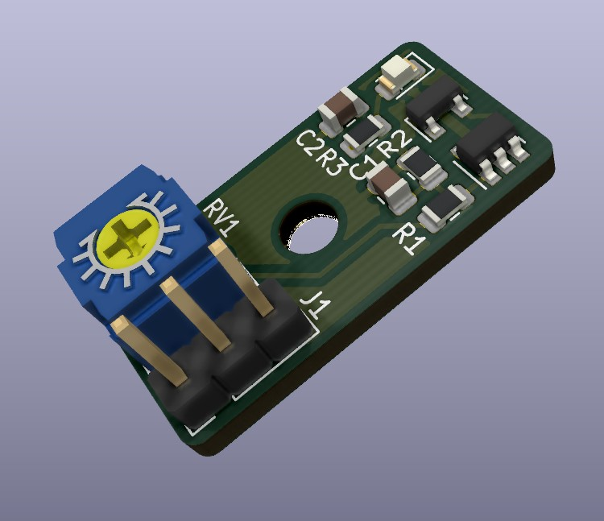

# Single Axis Hall Sensor for Voron
This is a hall effect sensor based of the existing Voron hall effect sensor for Voron v2.
Designed to be a single axis only and fit within the Y endstop area of V1.8 and be small enough to be flexible for mounting options for X axis.

This branch is the Normally Open variant of the board. This does not provide failsafe if the sensor / wiring fail.

This is designed for use with Voron v1.8 printer: https://github.com/VoronDesign/ http://vorondesign.com/
